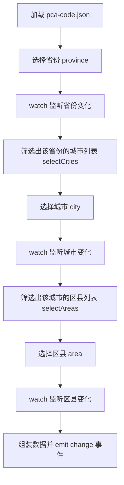

# ChooseArea 组件与 Install 插件实现总结

## 1. 功能概述 (Feature Overview)

**ChooseArea 组件** 是一个省市区三级联动选择器组件，主要功能包括：

- 省份、城市、区县三级级联选择
- 基于静态 JSON 数据（pca-code.json）进行数据联动
- 支持清空和禁用状态管理
- 通过 `@change` 事件向父组件传递完整的选中数据（包含 code 和 name）
- 使用 **install 插件方式**实现全局注册，可在任意组件中直接使用

## 2. 实现方案 (Implementation Scheme)

### 2.1 数据流转逻辑



### 2.2 插件注册架构

这里使用的就是Vue的插件装入技巧，当Vue使用APP.use的时候默认会去找对象下的install注册方法，因为在注册方法内包裹了app.component全局注册方法，所以可以将所有的组件注册合并到一个文件统一管理，支持全部引入和按需引入。

**单组件插件结构**（`chooseArea/index.ts`）：
```typescript
import type { App } from "vue"
import ChooseArea from "./src/index.vue"

export default {
    install(app: App) {
        app.component("m-choose-area", ChooseArea)
    }
}
```

**多组件统一管理**（`components/index.ts`）：
```typescript
import type { App } from "vue"
import Container from "./container/index"
import ChooseArea from "./chooseArea/index"
import ChooseIcon from "./chooseIcon/index"

const components = [Container, ChooseArea, ChooseIcon]

export default {
    install(app: App) {
        components.forEach((component) => {
            app.use(component)
        })
    }
}
```

**main.ts 中使用**：
```typescript
import components from './components'
app.use(components)
```

## 3. 编程语言技巧 (Language Tricks & Idioms)

### 3.1 TypeScript 类型导入

```typescript
import type { App } from "vue"
```
- **技巧说明**：使用 `import type` 进行纯类型导入
- **为什么重要**：启用 `verbatimModuleSyntax` 时，类型必须使用 `type` 关键字导入，否则会报错
- **好处**：类型导入不会被编译到运行时代码中，减小打包体积

### 3.2 响应式数据的类型标注

```typescript
const province = ref<string>("");
const selectCities = ref<AreaItem[]>([]);
```
- **技巧说明**：使用泛型为 `ref` 指定类型
- **好处**：提供更好的类型推断和代码提示，避免运行时类型错误

### 3.3 可选链和空值合并

```typescript
let cities = areas.value.find((item) => item.code === val)?.children!;
```
- **技巧说明**：`?.` 可选链操作符 + `!` 非空断言
- **注意**：这里假设数据一定存在，使用 `!` 断言。更安全的做法是添加默认值 `?? []`

### 3.4 watch 监听器的链式反应

```typescript
watch(() => province.value, (val) => {
    if (val) {
        selectCities.value = areas.value.find((item) => item.code === val)?.children!;
    }
    city.value = "";  // 重置下级选项
    area.value = "";
});
```
- **技巧说明**：上级选项变化时，自动清空下级选项，实现级联重置
- **好处**：保证数据一致性，防止出现无效的选择组合

### 3.5 插件模式的数组遍历注册

```typescript
const components = [Container, ChooseArea, ChooseIcon]

export default {
    install(app: App) {
        components.forEach((component) => {
            app.use(component)
        })
    }
}
```
- **技巧说明**：将所有组件插件放入数组，统一遍历注册
- **好处**：易于扩展和维护，新增组件只需添加到数组中

### 3.6 Vue 3 插件对象结构

```typescript
export default {
    install(app: App) {
        app.component("m-choose-area", ChooseArea)
    }
}
```
- **技巧说明**：导出包含 `install` 方法的对象，`install` 接收 `app` 实例作为参数
- **标准模式**：这是 Vue 3 官方插件规范，可与 `app.use()` 配合使用

## 4. 关键实现细节 (Key Implementation Details)

### 4.1 数据结构设计

**输入数据**（pca-code.json）：
```typescript
export interface AreaItem {
  code: string;        // 行政区划代码
  name: string;        // 名称
  children?: AreaItem[]; // 子级数据（递归结构）
}
```

**输出数据**（emit 事件）：
```typescript
export interface Data {
  code: string;  // 选中的代码
  name: string;  // 选中的名称
}

// emit 输出
{
  province: { code: "110000", name: "北京市" },
  city: { code: "110100", name: "市辖区" },
  area: { code: "110101", name: "东城区" }
}
```

### 4.2 联动逻辑实现

1. **省份变化** → 筛选城市列表 + 清空城市和区县
2. **城市变化** → 筛选区县列表 + 清空区县
3. **区县变化** → 组装完整数据并触发 `change` 事件

### 4.3 禁用状态控制

```vue
<el-select :disabled="!province" v-model="city">
<el-select :disabled="!province || !city" v-model="area">
```
- 城市选择器在未选择省份时禁用
- 区县选择器在未选择省份或城市时禁用
- 确保用户按照正确顺序操作

### 4.4 数据查找与组装

```typescript
let provinceData: Data = {
  code: province.value,
  name: areas.value.find((item) => item.code === province.value)?.name || ""
};
```
- 通过 `find` 方法根据 code 查找对应的 name
- 使用 `|| ""` 提供默认值，避免 undefined

### 4.5 全局注册的最佳实践

**组件内部**（`chooseArea/index.ts`）：
- 每个组件维护自己的 install 插件
- 组件名统一前缀 `m-` 避免命名冲突

**统一入口**（`components/index.ts`）：
- 创建主插件文件，统一管理所有组件
- 使用 `app.use(component)` 调用各组件的 install

**main.ts**：
- 一次性注册所有组件 `app.use(components)`
- 简洁高效，易于维护

### 4.6 使用方式

```vue
<template>
  <!-- 无需导入，直接使用 -->
  <m-choose-area @change="handleChange"></m-choose-area>
</template>

<script setup lang="ts">
const handleChange = (area: any) => {
  console.log('省：', area.province.name)
  console.log('市：', area.city.name)
  console.log('区：', area.area.name)
}
</script>
```

---

## 改进建议 (Suggestions for Improvement)

1. **数据安全性**：使用 `?? []` 替代 `!` 非空断言，避免潜在的运行时错误
2. **类型定义导出**：将 `AreaItem` 和 `Data` 接口导出，方便父组件使用
3. **可配置性**：考虑支持自定义组件名称、选择器宽度等配置项
4. **错误处理**：添加数据加载失败的提示和处理逻辑

